# Arlo Admin

**定位**：**审批流引擎** + **通用后台管理底座**。

自研可视化审批流（设计 → 发起 → 办理 → 监控），业务单据可直接挂流程；同时具备账号权限、组织、日志、文件、配置、消息、监控等后台能力，按模块继续扩展即可。

架构与目录约定见 [HANDOFF.md](./HANDOFF.md)。

## 在线体验

- 地址：[http://101.200.43.49/](http://101.200.43.49/)
- 账号：`admin` / `admin123`

## 界面预览

<table>
  <tr>
    <td width="50%" align="center">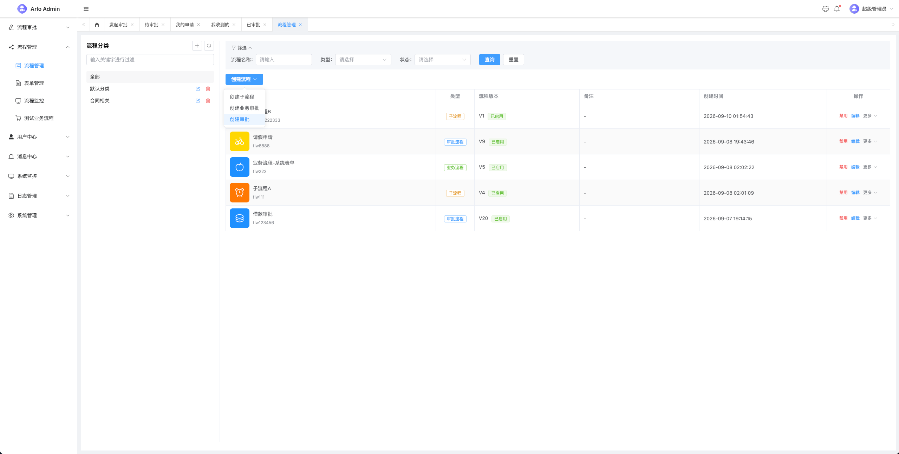<br/><sub>流程管理</sub></td>
    <td width="50%" align="center">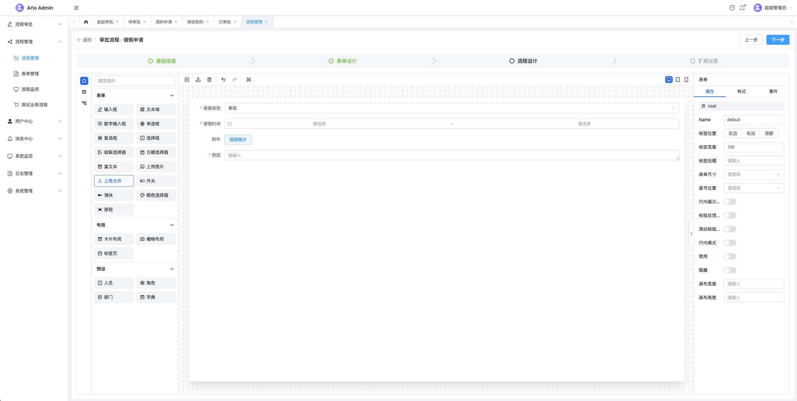<br/><sub>表单设计</sub></td>
  </tr>
  <tr>
    <td width="50%" align="center">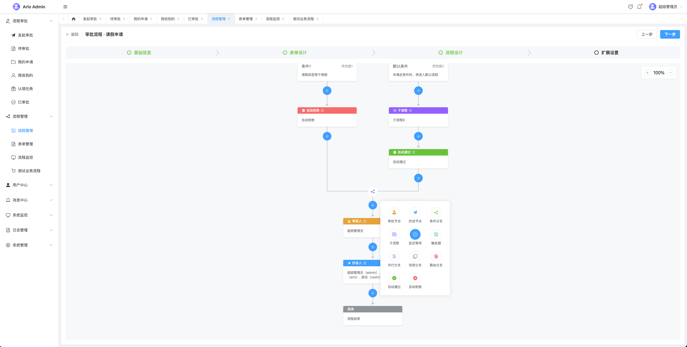<br/><sub>流程设计</sub></td>
    <td width="50%" align="center">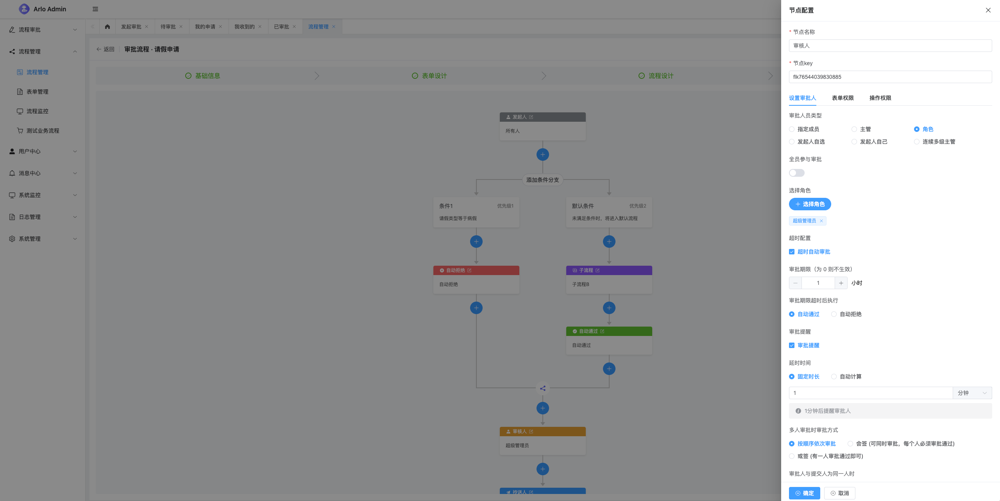<br/><sub>节点配置</sub></td>
  </tr>
  <tr>
    <td width="50%" align="center">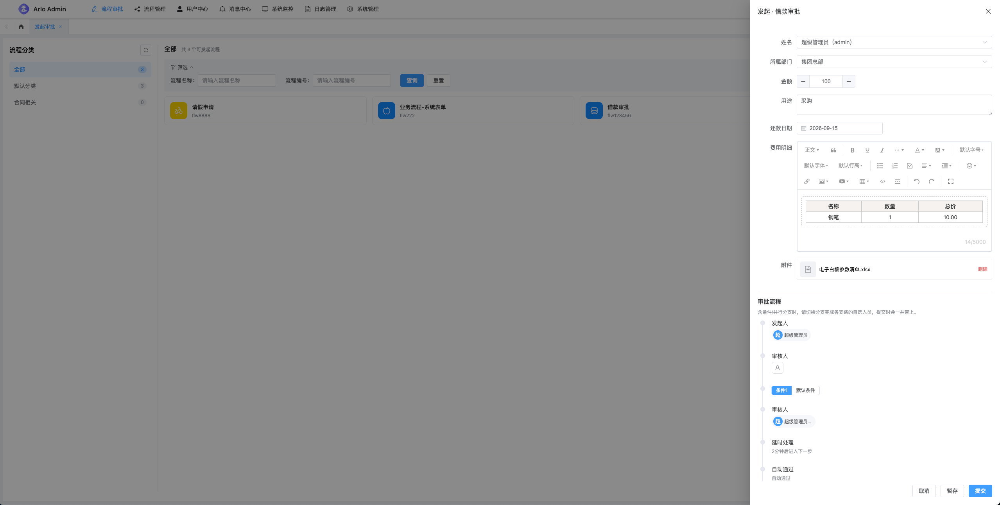<br/><sub>发起审批</sub></td>
    <td width="50%" align="center">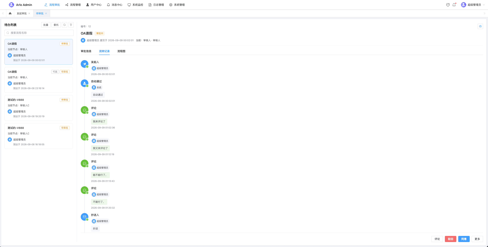<br/><sub>待审批</sub></td>
  </tr>
  <tr>
    <td width="50%" align="center">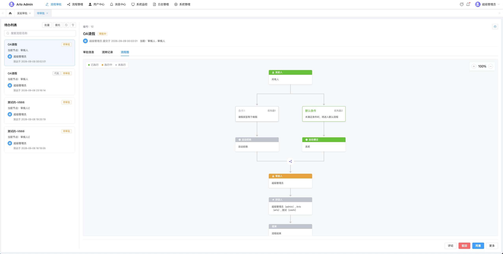<br/><sub>流程图</sub></td>
    <td width="50%" align="center">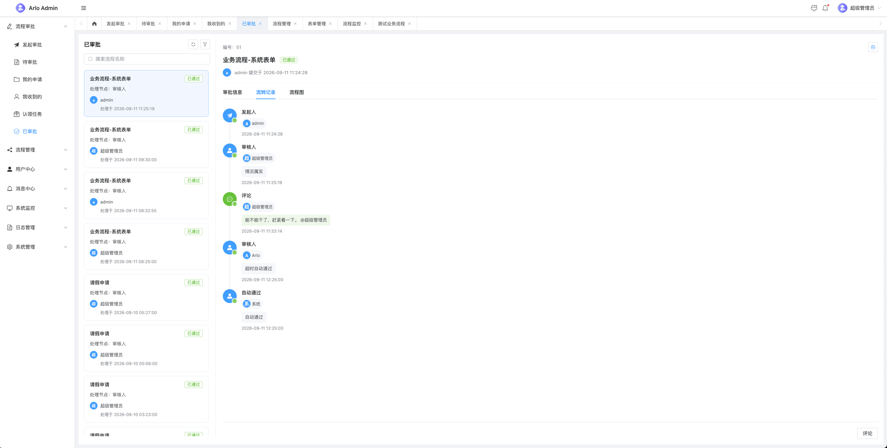<br/><sub>已审批 / 流转记录</sub></td>
  </tr>
  <tr>
    <td width="50%" align="center">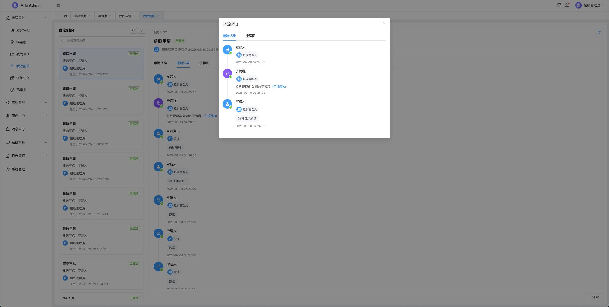<br/><sub>子流程详情</sub></td>
    <td width="50%" align="center">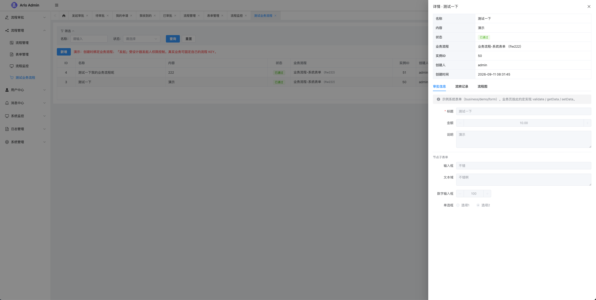<br/><sub>业务单据挂流程</sub></td>
  </tr>
  <tr>
    <td width="50%" align="center">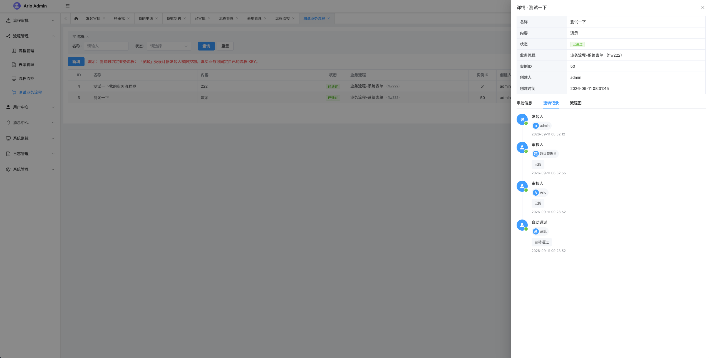<br/><sub>业务单据 · 流转记录</sub></td>
    <td width="50%"></td>
  </tr>
</table>

## 功能介绍

### 一、审批流引擎

菜单分两块：**工作流**（定义侧）与 **流程审批**（办理侧）。引擎在后端 `modules/flow/engine`，与 HTTP 解耦；表单用 epic-designer，并扩展了用户 / 部门 / 角色 / 字典 / 上传 / 富文本等控件。

#### 1. 流程与表单设计

| 能力 | 说明 |
|------|------|
| 流程管理 | 分类、启用/禁用、克隆、校验；模型 JSON 落库 |
| 表单管理 | 分类、模板 Schema 落库，可被流程引用 |
| 历史版本 | 定义变更留历史，支持检出回滚 |
| 节点类型 | 审批、抄送、条件分支、延时、触发、子流程等 |
| 审批模式 | 依次、会签、或签 |
| 办理人策略 | 指定人、角色、部门负责人、发起人自选等 |

#### 2. 发起与办理

| 场景 | 说明 |
|------|------|
| 发起审批 | 按已发布流程填单提交；支持暂存草稿、激活、改单重提 |
| 待审批 | 当前待办；同意 / 拒绝 / 退回；批量同意、批量拒绝 |
| 已审批 | 本人已办记录 |
| 我的申请 | 发起人侧：催办、撤销、草稿管理等 |
| 我收到的 | 抄送列表，支持已读 |
| 认领任务 | 角色池待认领任务 |
| 运行时协作 | 加签、减签、转办、委托代批、评论、补抄送 |
| 打印 | 审批单静态表格打印（含图片字段） |

列表支持按发起人、流程状态、时间范围等筛选。

#### 3. 监控与运维

| 能力 | 说明 |
|------|------|
| 流程监控 | 可管理范围内的实例；默认看审批中，可按状态/时间筛选 |
| 管理员动作 | 终止流程、管理员转办 |
| 定时推进 | 内置 `flow_tick`：延时节点到期、超时自动通过/拒绝、审批提醒站内信 |
| 流转可视 | 详情内表单、流转记录、流程图节点状态 |

#### 4. 业务扩展

业务表保存 `process_id` / `process_key`，走统一发起接口即可挂审批。仓库内 **演示采购单**（`modules/demo` / `views/business`）为完整示例。

| 端 | 路径 |
|----|------|
| 后端 | `arlo-admin-server/internal/modules/flow/` |
| 前端 | `arlo-admin-web/src/views/flow/`、`components/flowProcess/`、`designer-extensions/` |
| 库表 | 全新安装 `001_baseline`；旧基线升级 `002_flow_approve_runtime.sql` |

---

### 二、通用后台管理底座

| 模块 | 能力 |
|------|------|
| 认证与权限 | JWT 登录/刷新；Casbin 菜单与按钮权限；角色数据权限（全部 / 本部门 / 自定义等） |
| 组织人事 | 用户（改密、解锁、Excel 导入导出）、角色、部门树、岗位、字典 |
| 菜单路由 | 动态菜单与前端动态路由；`v-permission` 控制按钮 |
| 文件 | 上传（MD5 去重）、列表删除、鉴权下载；`accessKey` 预览 |
| 消息 | 站内信（指定/广播、已读、未读数，WebSocket 推送）；通知公告发布/撤回 |
| 日志 | 登录日志、操作日志，可导出 |
| 系统配置 | 键值配置（含 Logo、验证码、密码策略等） |
| 监控 | 在线用户与强制下线、服务监控 |
| 定时任务 | 进程内调度；管理端启停/手动执行（如日志清理、流程定时） |
| 界面 | 多主题、侧栏 / 混合 / 顶栏布局；ProTable 等通用组件 |
| 会员 | 管理端列表等；客户端登录/微信等仍为预留 |

---

## 仓库结构

| 目录 | 说明 |
|------|------|
| [arlo-admin-server](./arlo-admin-server/) | 后端 API（启动 / 迁移 / 扩展模块） |
| [arlo-admin-web](./arlo-admin-web/) | 管理端前端（启动 / 代理 / 约定） |
| [deployments](./deployments/) | 生产部署（Compose / Linux / 宝塔） |
| [HANDOFF.md](./HANDOFF.md) | 架构约定、工作流模块说明、坑点与扩展 |

早期规划草稿已废弃，**以代码与 HANDOFF 为准**。

## 技术栈

- **后端**：Go、Gin、GORM、MySQL 8、Redis、JWT、Casbin、Zap、Viper
- **前端**：Vue 3、TypeScript、Vite、Pinia、Element Plus

## 快速开始

### 1. 数据库

```bash
mysql --default-character-set=utf8mb4 -u root -p < arlo-admin-server/migrations/001_baseline_v1.sql
# 已有旧基线库再执行：002_flow_approve_runtime.sql（见 migrations/README.md）
```

### 2. 后端

```bash
cd arlo-admin-server
# 修改 configs/config.yaml 中的 MySQL / Redis
make dev
# 默认 http://localhost:8090  · 健康检查 /health
```

### 3. 前端

```bash
cd arlo-admin-web
npm install
npm run dev
# 默认 http://localhost:5173
```

默认账号：`admin` / `admin123`（以种子数据为准）。

## 生产部署

详见 **[deployments/README.md](./deployments/README.md)**（Compose 一键、单机 Linux、宝塔）。

```bash
cp deployments/docker/.env.example deployments/docker/.env
# 编辑 MYSQL_PASSWORD / JWT_SECRET / CORS_ORIGIN
make docker-up
# 浏览器打开 http://localhost  · 默认 admin / admin123（登录后立即改密）
```

## 文档导航

| 文档 | 内容 |
|------|------|
| [HANDOFF.md](./HANDOFF.md) | 分层、权限、工作流模块、坑点、扩展方式 |
| [deployments/README.md](./deployments/README.md) | 生产部署 |
| [arlo-admin-server/README.md](./arlo-admin-server/README.md) | 后端启动与迁移 |
| [arlo-admin-web/README.md](./arlo-admin-web/README.md) | 前端启动与约定 |

生产上线前请完成密钥轮换、HTTPS、备份与监控（见部署文档检查清单）。
